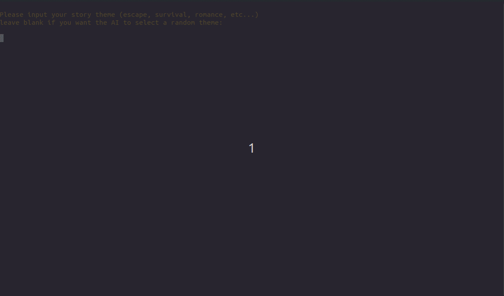

GPT Interactive Novel
============

A customizable interactive fiction novel that utilizes GPT. Playable straight from your terminal!

## Features
- Experience an interactive fiction novel with a clear beginning and end goal.
- Choose your own story setting and theme.
- Insert as many characters as you want to the story.
- Choose your story length
- Choose between choice based novels or free text novels

---

## Setup
- Clone this repository by running `git clone https://github.com/that-one-arab/gpt-interactive-novel`
- CD into the work directory `cd gpt-interactive-novel`
- **RECOMMENDED**: Create a virtual environment. if you use [virtualenvwrapper](https://virtualenvwrapper.readthedocs.io/en/latest/index.html) you can run `mkvirtualenv gpt-interactive-novel`
- Install required libraries `pip install -r requirements.txt`
- Copy example .env file `cp .env.example .env`
- Add your OpenAI key to the `.env` file

---

## Usage
- CD into the work directory if you're not already in it
- Run `python index.py`

---

## Limitations
**Some game features do not work well with `gpt-3.5`, due to that it is recommended to use `gpt-4` to play the game.**

---
## Buy me a coffee

Do you think I deserved a coffee break? buy me one!

---

## License
This project is licensed under the terms of the **MIT** license.

---